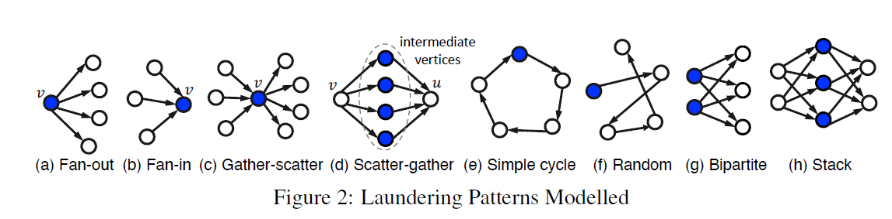
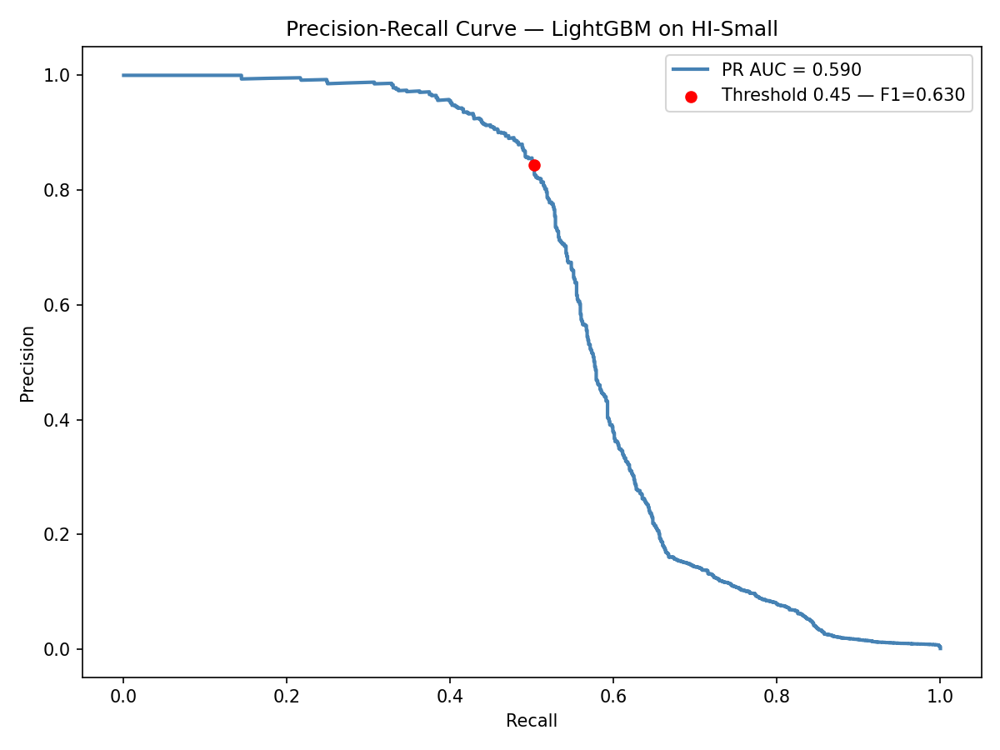

# AML Transaction Detection — LightGBM + Graph Features

## 💡 Project Summary

Money laundering is the process by which illicit funds are given the appearance of legitimacy. It is generally described as a sequence of three phases:

- **Placement** — illicit funds enter the financial system
- **Layering** — funds are moved repeatedly to obscure their criminal origin
- **Integration** — funds are used to purchase goods, services or investments

This project focuses on the layering phase, where criminal organisations use laundering schemes to obfuscate the origin of their funds. Beyond KYC and due diligence, financial institutions and regulators are concerned with detecting these patterns in transaction data.

The documented money laundering motifs targeted here are:

| Motif | Description |
|---|---|
| Fan-In | Many accounts sending funds to a single account |
| Fan-Out | A single account sending funds to many accounts |
| Cycle | Funds circling back to the originating account |
| Scatter-Gather | Funds split across many accounts then recombined |
| Gather-Scatter | Funds gathered then redistributed |
| Bipartite | Two groups of accounts transacting back and forth |
| Stack | Sequential layering through a chain of accounts |
| Random | Randomised transaction patterns |



<p><em>Source: Altman et al., <a href="https://arxiv.org/abs/2306.16424">AMLworld: A Large-Scale Synthetic Dataset for Anti-Money Laundering</a>, AAAI 2024.</em></p>

---

## 📊 Dataset

The dataset is the **AMLworld HI-Small** synthetic dataset released by IBM Research, designed specifically for benchmarking AML detection models. It contains approximately 5 million transactions over a 10-day period in September 2022, with a ~1:1000 illicit-to-legitimate ratio.

The dataset is available on [Kaggle](https://www.kaggle.com/datasets/ealtman2019/ibm-transactions-for-anti-money-laundering-aml).

**Features used:**

*Hand-crafted:*
- Payment format, currency, entity type
- Cross-currency transaction binary flag
- Transaction amount bin (converted to USD)
- Hour of day, day of week

*Graph-based (Snap ML GFP):*
- Fan-in / fan-out degree counts per account within time windows
- In/out degree bins
- Scatter-gather, temporal cycle and length-constrained cycle participation
- Vertex statistics: fan, degree, ratio, max, median, variance and skew of amount and time per account

---

## 🎯 Results

This model reproduces and slightly exceeds the GFP + LightGBM benchmark from the original AMLworld paper (**F1 = 0.630 vs 0.623**), evaluated at a classification threshold of 0.45. The dataset has an illicit transaction ratio of approximately 1:1000 — under this level of class imbalance, F1 is a much more demanding metric than accuracy and scores in this range are considered strong.

<!--  -->



**Per-pattern recall on the validation set:**

| Pattern | Recall |
|---|---|
| Scatter-Gather | 0.899 |
| Fan-In | 0.887 |
| Gather-Scatter | 0.867 |
| Fan-Out | 0.841 |
| Random | 0.755 |
| Stack | 0.658 |
| Cycle | 0.633 |
| Bipartite | 0.667 |
| **No documented pattern** | **0.010** |

When evaluated only on laundering transactions with a documented motif, F1 reaches **0.87** — significantly higher than the overall score of 0.630. The gap comes from the model being essentially blind to laundering transactions that don't follow any known structural pattern, which bring the overall score down.

What these undocumented transactions represent exactly is not entirely clear from the paper, but they may correspond to placement or integration phase activity — transactions that look like normal economic behaviour and carry no structural signal that motif-based features can pick up on.

---

## 🗂️ Project Structure

- `01_pattern_labelling.ipynb` — assign motif labels from HI-Small_Patterns.txt (used for error analysis only, not in inference)
- `02_feature_engineering.ipynb` — hand-crafted and graph-based features, saved to numpy arrays
- `03_modelling_and_tuning.ipynb` — model fitting, hyperparameter search, threshold tuning, results and per-pattern error analysis

---

## 🚀 How to Run

Install dependencies:
```bash
pip install -r requirements.txt
```

Run notebooks in order (01 → 02 → 03). Notebook 02 is the most compute-intensive — it runs the GFP pipeline over ~5M transactions. Intermediary arrays are saved to `.npy` files so you don't have to rerun from scratch if the kernel crashes.

**Note:** Polars is used throughout instead of pandas. Do not replace it with pandas — the dataset is large enough to cause memory issues.

The raw dataset is not included in this repo. Download it from Kaggle and update the `path` variable in each notebook accordingly.

---

## 📌 Future Work

The per-pattern error analysis points to a clear limitation of the motif-based approach — it works well on known patterns but fails on transactions that don't conform to a documented structure. A GNN-based model that learns representations directly from the transaction graph is the natural next step, particularly for improving detection on these harder cases.

---

## 📚 References

- Altman et al., *[AMLworld: A Large-Scale Synthetic Dataset for Anti-Money Laundering](https://arxiv.org/abs/2306.16424)*, AAAI 2024.
- Snap ML, *[Graph Feature Preprocessor — API Documentation](https://snapml.readthedocs.io/en/v1.15/graph_preprocessor.html)*.
- Snap ML, *[Examples](https://github.com/IBM/snapml-examples)*.